# Multi-Sensor Fusion — Architecture

## 1. Purpose

This repository delivers a Linux-first, container-based reimplementation of the
SAPIENT BSI Flex 335 v2.0 stack. The upstream reference
([`dstl/BSI-Flex-335-v2-Test-Harness/`](dstl/BSI-Flex-335-v2-Test-Harness/)) is Windows-only
(WinForms, .NET on Windows, hard-pinned PostgreSQL 12) and cannot run on Ubuntu
or Nvidia Orin. The rewrite preserves wire compatibility with that reference so
existing SAPIENT components can interoperate unchanged.

Build order:

1. **Middleware** (this iteration) — the "message handling application" of the
   spec. Persists and forwards SAPIENT messages between edge nodes and a fusion
   node.
2. **Edge node** — replaces the reference `SapientAsmSimulator`.
3. **Fusion node** — replaces the reference `SapientDmmSimulator`. Will use
   [Stone-Soup](https://stonesoup.readthedocs.io/) for multi-target tracking.
4. **GUI** — implementation-specific per the spec; visualisation and
   tasking/alert-ack input. Not in scope for this iteration but designed for.

Language: **Python 3.12+**, asyncio, asyncpg, generated protobuf bindings.
Single Python runtime across middleware, edge, and fusion (Stone-Soup is
Python).

## Current state — what's built today (2026-05-02)

The middleware/edge/fusion/GUI services described later in this doc are
still **target architecture**, but the live stack now spans three
loosely-coupled Docker services rather than one. The UI is no longer the
SAPIENT-talks-to-everything monolith — it is an edge node, and Apex (the
vendored Python SAPIENT middleware) sits in the middle of the chain.

| Service | Role |
|---|---|
| [`ui`](ui/) | FastAPI SPA. Template-driven SAPIENT v2 sender. Treated as one edge node. Default target is Apex on `127.0.0.1:5020`. |
| [`apex`](apex/) | Vendored [Apex SAPIENT Middleware](dstl/Apex-SAPIENT-Middleware/) (Trio/Python). Accepts Child/Peer registrations, forwards outbound to `cot-bridge` and to the Windows BSI Flex harness via Parent `forwardAll`. |
| [`cot-bridge`](cot-bridge/) | Standalone SAPIENT → CoT → TAK fan-out. Accepts SAPIENT length-prefix protobuf on TCP/5005, UDP-sends CoT XML to TAK Server. |

Everything runs on host networking so containers see each other on
`localhost`. Earlier versions had the UI doing its own TAK fan-out (and a
happy-path Linux SAPIENT stub for offline mock-ups) — both have been
retired into [`deprecated/`](deprecated/) now that Apex covers the flows
and `cot-bridge` owns the CoT path.

### System topology (today)

All three services run with `network_mode: host`, so the inter-service
hops below are real `localhost` TCP connects (not docker-bridge NAT).
Ports labelled on edges; ports labelled on the boxes are everything Apex
listens on, even if only one is wired up by default.

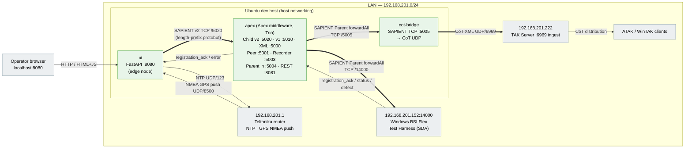

**Read it as:** thick (`==>`) arrows are the SAPIENT/CoT data path; thin
arrows are sidecar / control traffic. The two `Parent forwardAll` edges
out of Apex fire in parallel — that's how a single Send from the UI ends
up both on the Windows reference harness and on the TAK map without the
UI knowing about either endpoint.

### What's inside the UI container

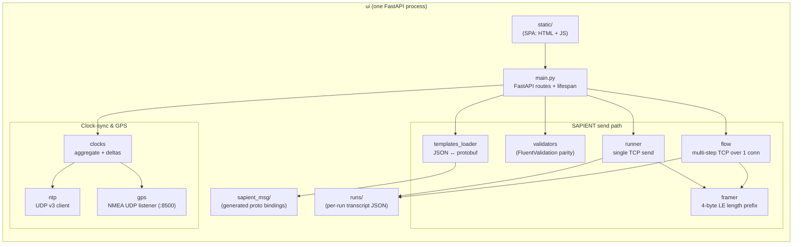

### One Send lifecycle

The key property is that the UI's HTTP response does **not** wait for
the Parent fan-out. Apex acks the Child connection straight away (or
synthesises one for messages that don't normally get acked), and the
forwarded copies to BSI and to `cot-bridge` happen on Apex's Trio
nursery without blocking the UI.

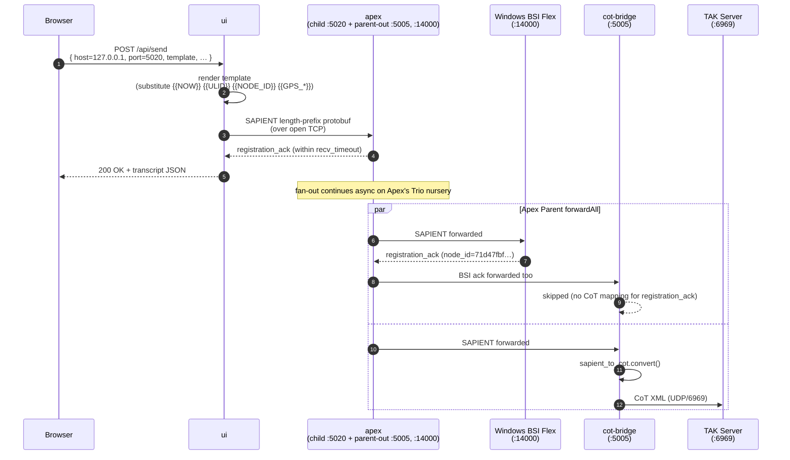

**Things to know, not visible in the diagram:**
- The UI's `recv_timeout_s` only waits for the *Child* response from
  Apex. If you want to see BSI's ack arrive too, use the `Flow` mode and
  bump the drain — the BSI-originated reply is forwarded back through
  Apex on the same TCP socket.
- `cot-bridge` will skip any SAPIENT message it has no CoT mapping for
  (e.g. `registration_ack`, `error`) and bumps a `skipped_no_mapping`
  counter — that's expected, not a failure.
- Apex itself logs a deprecation warning at startup because it still
  uses `trio.MultiError.catch`; we pin `trio==0.23.1` for that reason.
  Functional, but a future Python/Trio bump will need upstream patches.

### Module → spec role map

| Spec concept (§ in BSI Flex 335 v2) | Today's module | Future home |
|---|---|---|
| Length-prefix framing (§4.2) | `ui/app/framer.py`, `cot-bridge/app/framer.py` | edge / middleware libs |
| Message wrapper (§4 Table 1) | `ui/app/templates_loader.py` + `proto_to_template.py` | edge |
| Validation rules (informal) | `ui/app/validators.py` | edge + middleware |
| ASM-side message generation (§4.5) | `ui/app/runner.py`, `ui/app/flow.py` | edge-node |
| SAPIENT middleware (§0.4) | `apex/` (vendored Apex) | this stays |
| Edge-node forwarding to fusion | Apex `Parent forwardAll` | middleware |
| GUI link (§0.4 implementation-specific) | `ui/app/static/` SPA | future `gui` service |
| Clock sync (§4.1 NTP requirement) | `ui/app/clocks.py`, `ui/app/ntp.py` | OS / chrony layer |
| GPS source (BSI Flex agnostic) | `ui/app/gps.py` (NMEA listener) | edge-node |
| SAPIENT → CoT bridge | `cot-bridge/` + `libs/sapient-to-cot/` | middleware fan-out plugin |

### Where this departs from the target

- The target architecture splits message handling, persistence, edge,
  fusion, and GUI into separate containers. Today we have edge (`ui`),
  middleware (`apex`), and a CoT fan-out (`cot-bridge`) — but no fusion
  node, no dedicated GUI service, and Apex's persistence (Elasticsearch)
  is disabled.
- LAN endpoints (router, Windows, TAK) are baked into
  `docker-compose.yml` and `apex/apex_config.json`. The planned mitigation
  is a `.env` file: current values become defaults in `.env.example`,
  real values gitignored.
- No PostgreSQL today. UI runs persist as JSON under `ui/runs/`; Apex's
  Elasticsearch store is off.

The rest of this document describes the **target** — what we are working
towards as the middleware/edge/fusion/GUI iterations land.

---

## 2. Conformance to BSI Flex 335 v2.0

The implementation conforms to the spec sections listed below. Where the
upstream reference deviates from the spec, the rewrite follows the spec.

| Spec section | Requirement | Implementation |
|---|---|---|
| §0.4 | Middleware is **transparent**: stores/forwards but does not modify message content | Enforced — no `Location`/`RangeBearing`/`NodeId` mutation. Reference's `CartesianOffset`/`BearingOffset` and `fixedAsmId` rewrite are dropped. |
| §4.1 | TCP/IP, NTP-synced clocks, Protobuf v3, UUID `node_id`, ULID `report_id` | TCP server/client; container relies on host NTP; `protoc` generates Python bindings; `node_id` validated as UUID; `report_id` validated as ULID. |
| §4.2 | 4-byte little-endian length prefix per message | Length-prefix framer (mirrors `ByteDataMessageBuilder.cs` semantics). |
| §4.4 | Initialization: register → ack → first status | Implemented in connection state machine. |
| §4.5 | Normal operation: status, detection, task, taskAck, alert | Per-content-case routing. |
| §4.6 | Alert process with alert-ack accept/reject | Alert and AlertAck both persisted (the reference does not persist AlertAck — known issue). |
| §4.7 | Task / TaskAck round-trip | Implemented. |
| §4.8 | Shutdown sends Status with `system=GOODBYE` | Edge-node responsibility; middleware logs and removes registration. |
| §4.9 | 10s reconnect retry; <2 min reconnect skips re-registration | In-memory registry with TTL keyed by `node_id`. |
| §4.10 | Platforms (POINTABLE_NODE / MOBILE_NODE) | Carried transparently in registration; no special handling. |
| §4.11 | Hierarchical fusion nodes | Supported by treating a child fusion node as just another registered node. |
| §6 | Outer message types | All nine `oneof content` cases are routed and persisted. |

## 3. System context

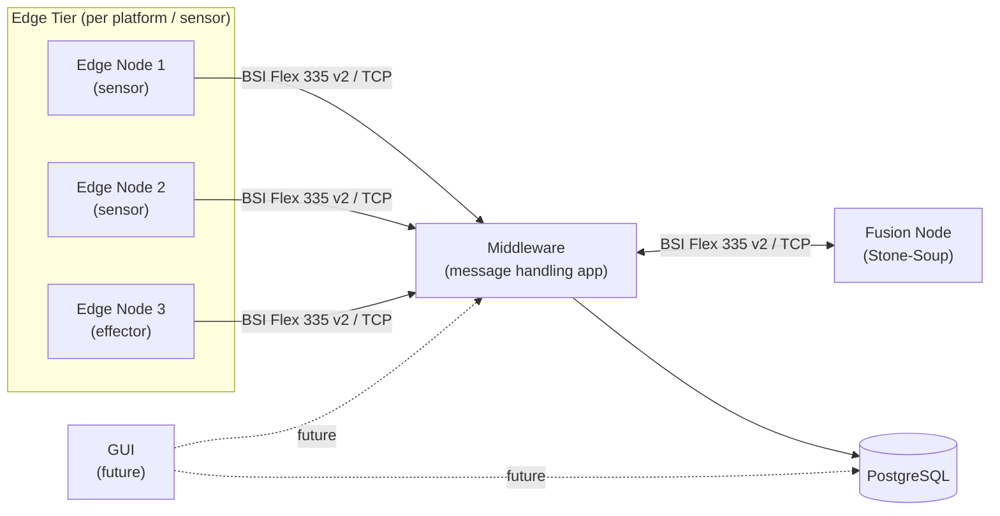

The fusion node behaves as the **server** for tasking; edge nodes and the
middleware are clients of one another depending on direction. The middleware
never alters message content — it persists, indexes, and forwards.

## 4. Container topology

Each box below is a Docker container. The middleware and database run in
this iteration; edge/fusion/gui are scaffolded for the future.

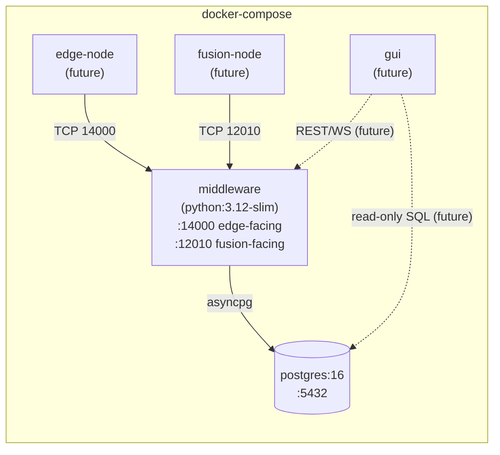

Notes:

- The reference pins PostgreSQL 12. We use 16 because we own the schema and
  parameterise everything (the reference's raw-SQL approach is a
  documented SQL-injection risk).
- NTP is the **host's** responsibility; containers inherit the kernel clock.
  Document `chronyd`/`systemd-timesyncd` as a deploy prerequisite.

## 5. Middleware — internal design

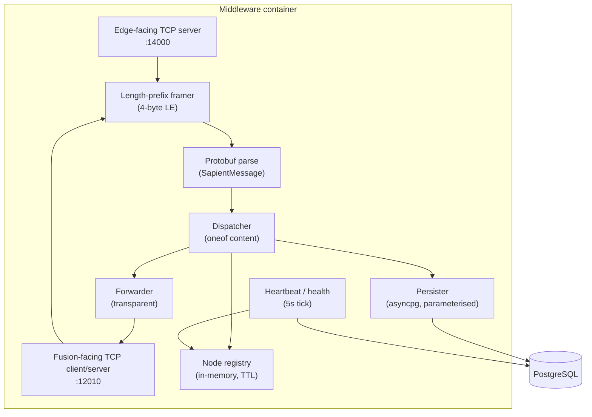

Component responsibilities:

- **Edge-facing TCP server**: accepts edge-node connections; one task per
  connection.
- **Fusion-facing endpoint**: in MHA mode the middleware acts as a client of
  the fusion node (so the fusion node is "the server" per spec §0.4); a config
  flag also lets it listen if needed.
- **Framer**: reads the 4-byte little-endian length prefix and yields exact
  message frames. Mirrors the semantics of
  [`ByteDataMessageBuilder.cs`](dstl/BSI-Flex-335-v2-Test-Harness/SAPIENTMessageProcessor/ByteDataMessageBuilder.cs).
- **Dispatcher**: switches on `SapientMessage.WhichOneof('content')` and runs
  the appropriate handler. No mutation of the message.
- **Registry**: tracks `node_id → (last_seen, capabilities, registered_at)`.
  Honours §4.9 reconnection grace (2 min). On shutdown (Status `system=GOODBYE`),
  drop the entry.
- **Persister**: writes the canonical message + extracted indexed columns to
  Postgres in a single transaction per message. Uses parameterised SQL
  exclusively.
- **Forwarder**: passes messages through unmodified to the fusion node (or to
  the appropriate edge node for Task / RegistrationAck / AlertAck).
- **Heartbeat**: 5s tick recording connection counts and latency to the
  `middleware_log` table; used by GUI dashboards later.

## 6. Message lifecycle

### 6.1 Registration → first status

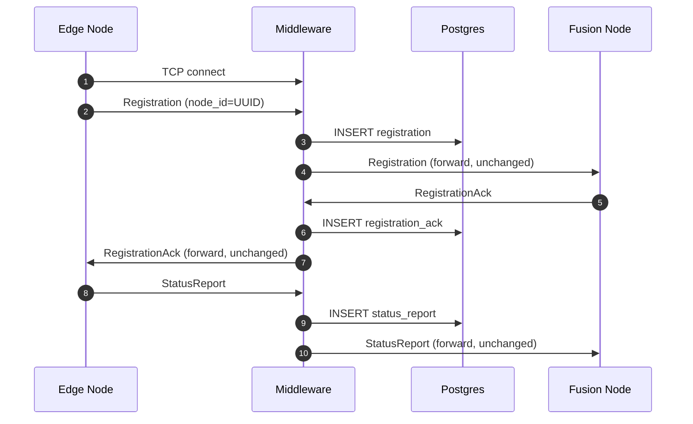

### 6.2 Detection / task / taskAck

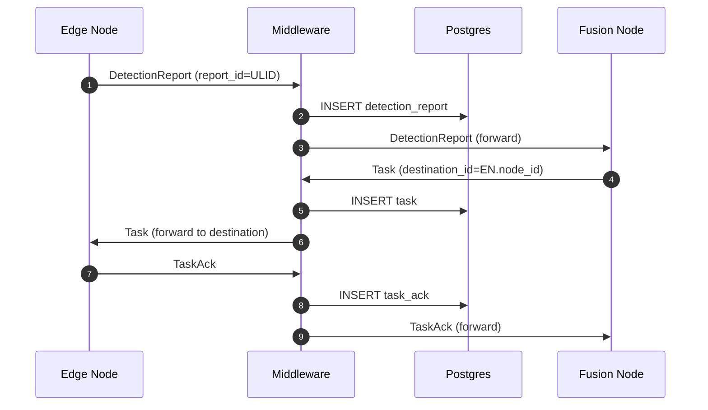

### 6.3 Alert and alert-ack

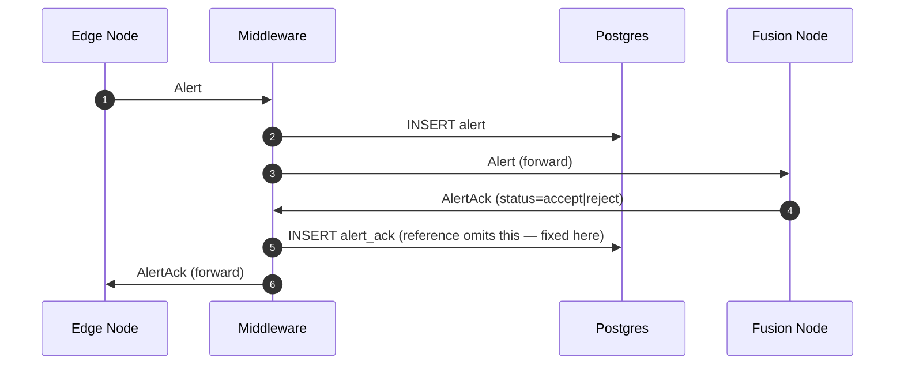

### 6.4 Lost connection (§4.9)

```mermaid
sequenceDiagram
    autonumber
    participant EN as Edge Node
    participant MW as Middleware

    Note over EN,MW: Connection drops
    EN-->>MW: TCP RST / timeout
    MW->>MW: Mark node disconnected;<br/>retain registry entry for 2 min

    loop every 10s
        EN->>MW: TCP connect attempt
    end

    alt Reconnect within 2 min
        EN->>MW: StatusReport (no re-register)
        MW->>MW: Refresh last_seen
    else Reconnect after 2 min
        EN->>MW: Registration (mandatory)
    end
```

## 7. Wire format

Every byte stream consists of repeated frames:

```
+--------+------+------+------+------+------+------+------+------+
| len    | byte | byte | ...  | byte |  len | byte | byte | ...  |
| (4 LE) |  1   |  2   |  ... |  N   | (4LE)|  1   |  2   |  ... |
+--------+------+------+------+------+------+------+------+------+
| <----- protobuf SapientMessage -----> |
```

- `len` = 32-bit little-endian, payload length in bytes (excludes the 4-byte
  prefix). Per spec §4.2; this differs from standard Google framing.
- Payload = a `SapientMessage` (see [sapient_message.proto](dstl/SAPIENT-Proto-Files/bsi_flex_335_v2_0/sapient_message.proto)).
  Mandatory fields: `timestamp`, `node_id`, exactly one of the `content` oneof.

## 8. Database schema (sketch)

One table per outer message, plus indexes. Key columns are typed so we can
query without reaching back into the protobuf payload.

| Table | Purpose | Key columns |
|---|---|---|
| `registration` | Edge-node registrations | `key_id`, `message_time`, `node_id`, `node_type[]`, `icd_version`, `payload_pb` |
| `registration_ack` | Acks from fusion | `key_id`, `message_time`, `node_id`, `destination_id`, `payload_pb` |
| `status_report` | Periodic status | `key_id`, `report_time`, `node_id`, `report_id` (ULID), `system`, `payload_pb` |
| `detection_report` | Detections | `key_id`, `report_time`, `node_id`, `report_id`, `object_id`, `location_geom`, `payload_pb` |
| `task` | Tasks from fusion | `key_id`, `message_time`, `task_id`, `node_id`, `destination_id`, `payload_pb` |
| `task_ack` | Edge taskAcks | `key_id`, `message_time`, `task_id`, `node_id`, `task_status`, `payload_pb` |
| `alert` | Edge alerts | `key_id`, `alert_time`, `node_id`, `alert_id`, `priority`, `payload_pb` |
| `alert_ack` | Fusion alert responses | `key_id`, `message_time`, `alert_id`, `node_id`, `status`, `payload_pb` |
| `error` | Error messages | `key_id`, `message_time`, `node_id`, `payload_pb` |
| `middleware_log` | Connection counts, latency | `tick_time`, `num_edges`, `num_fusion`, `comms_latency_ms`, `db_latency_ms` |

`payload_pb` is the raw `SapientMessage` bytes, allowing lossless replay and
audit. Geographic columns use PostGIS where applicable.

Tables omitted from the reference and not reintroduced:

- `objective`, `route_plan` ("Zodiac" tables — not in BSI Flex 335 v2).
- `sensor_location_offset` — only existed to drive `CartesianOffset` mutation,
  which the middleware no longer performs.

## 9. Tech stack

| Concern | Choice | Why |
|---|---|---|
| Language | Python 3.12 | Shared runtime with future fusion (Stone-Soup) and edge nodes |
| Async runtime | `asyncio` | Native, fits TCP server workloads |
| Database driver | `asyncpg` | Fastest PG driver in Python; native parameterisation |
| Protobuf | `protobuf` + `protoc` v3 | BSI Flex requires protobuf v3 |
| Logging | `structlog` (JSON) | Container-friendly structured logs |
| Config | env vars + `pydantic-settings` | 12-factor; matches container deploys |
| DB | PostgreSQL 16 (+ PostGIS) | We own the schema; modern PG is fine |
| Container base | `python:3.12-slim` | Small, multi-arch (linux/amd64, linux/arm64 for Orin) |
| Orchestration | `docker compose` (dev), TBD (prod) | Compose for the local dev/test loop |

## 10. Project layout (target)

```
multi-sensor-fusion/
├── Architecture.md                  this document
├── docker-compose.yml               middleware + db + (later) edge/fusion/gui
├── proto/                           generated Python bindings checked in
├── middleware/
│   ├── Dockerfile
│   ├── pyproject.toml
│   ├── src/middleware/
│   │   ├── __main__.py              entrypoint
│   │   ├── config.py                pydantic-settings
│   │   ├── framing.py               4-byte LE length prefix codec
│   │   ├── tcp/
│   │   │   ├── server.py            edge-facing
│   │   │   └── client.py            fusion-facing
│   │   ├── dispatch.py              oneof switch → handlers
│   │   ├── handlers/                one per outer message
│   │   ├── registry.py              node_id → state, TTL
│   │   ├── persistence/             asyncpg + parameterised SQL
│   │   ├── forwarder.py             transparent forwarding
│   │   └── health.py                heartbeat tick
│   └── tests/
├── db/
│   ├── Dockerfile                   postgres:16 + PostGIS + init SQL
│   └── init/                        schema + indices
├── edge-node/                       future
├── fusion-node/                     future
├── gui/                             future
├── deprecated/compat-baseline/      original CLI baseline harness (kept for history; superseded by ui/)
├── dstl/BSI-Flex-335-v2-Test-Harness/    upstream reference (unchanged)
├── dstl/SAPIENT-Proto-Files/             upstream protos (unchanged)
├── Stone-Soup/                      vendored for future fusion node
└── spec/
    └── bsi-flex-335.pdf
```

## 11. Deviations from the upstream reference (intentional)

| Reference behavior | Rewrite | Rationale |
|---|---|---|
| WinForms GUI in the same process | Headless service; GUI is a separate future container | Spec §0.4: GUI is implementation-specific. Linux container can't host WinForms. |
| `CartesianOffset` / `BearingOffset` mutate Location/RangeBearing | Removed | Spec §0.4 NOTE 2: middleware must be transparent. |
| `fixedAsmId` rewrites incoming `node_id` | Removed | Same — transparency. |
| Two binaries (`SDA` / `DMM-DA`) selected by `DMM` flag | Single middleware service with edge-facing + fusion-facing endpoints | Reference split was a Windows-process-isolation artefact; unnecessary in containers. |
| Raw SQL string concatenation | `asyncpg` parameterised statements only | Reference's README acknowledges SQL-injection risk. |
| `objective`, `route_plan` tables ("Zodiac") | Dropped | Not part of BSI Flex 335 v2. |
| Alert ack not persisted (known issue) | Persisted in `alert_ack` table | Spec §4.6. |
| PostgreSQL 12 hard-pin | PostgreSQL 16 | We own the schema; no PG-12-specific features used. |
| `app.config` XML application settings | Env vars + pydantic-settings | 12-factor. |
| log4net XML | `structlog` JSON | Container-friendly. |

## 12. GUI (future, not yet in scope)

The spec leaves the GUI as implementation-specific. Planned shape:

- Separate container, web-based (probably FastAPI + a SPA — to be decided).
- Read-only access to Postgres for live dashboards (connection counts, latency,
  detection map).
- Outbound channel through the middleware for Task issuance and AlertAck, so
  the GUI never speaks BSI Flex 335 directly to edge nodes.

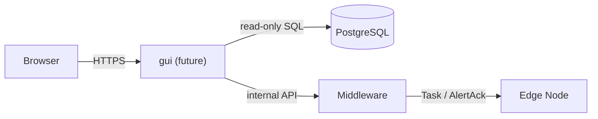

## 13. Compatibility verification against the Windows reference

Behavior is locked down by the **ui** at
[`ui/`](ui/) — a Docker-packaged web UI that drives any
SAPIENT v2 message into a configurable host:port and inspects the wire
conversation. To verify the middleware is wire-compatible with the Windows
reference, we point the UI's **Host** field at either:

- the Windows reference (`192.168.201.152:14000`) — the today path
- the new Python middleware (when it lands) — the same flows just retargeted

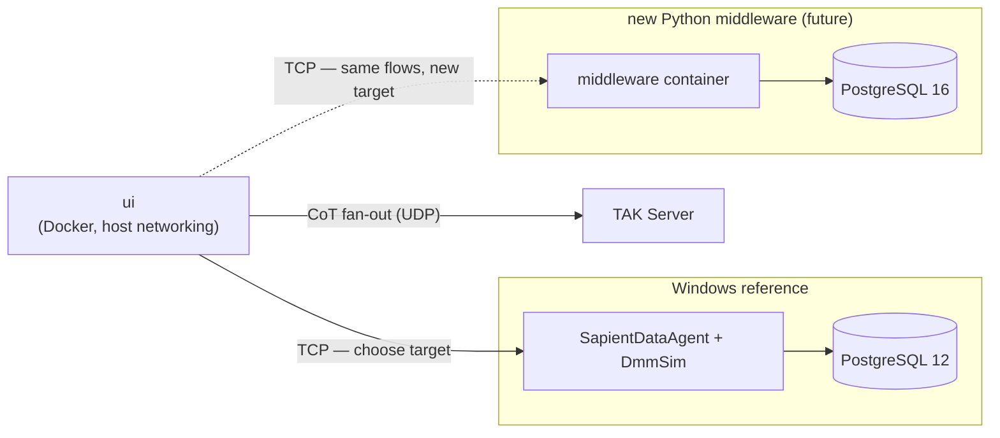

Earlier exploratory CLI tooling that captured wire bytes from the Windows
harness lived under `compat-baseline/` and has been moved to
[`deprecated/compat-baseline/`](deprecated/compat-baseline/) — the
captured `baselines/` artifacts and the validator quirks documented there
are still useful as historical context. None of it is wired into active
work; the ui replaces it.

## 14. Roadmap

1. **Iteration 1 — middleware** (current): TCP framer, dispatcher, registry,
   persister, forwarder, health, Postgres schema, container, compose.
   Verification surface is the ui — point it at the new
   middleware once running.
2. **Iteration 2 — edge node**: a Python edge-node service that registers,
   sends status/detection/alert, accepts tasks. Replaces `SapientAsmSimulator`.
3. **Iteration 3 — fusion node**: Stone-Soup-based fusion that consumes
   detections from the middleware, emits tasks, handles alert-ack. Replaces
   `SapientDmmSimulator`.
4. **Iteration 4 — GUI**: separate container; web UI on top of the database
   and middleware control plane.
5. **Iteration 5 — Orin packaging**: linux/arm64 image builds, NTP/systemd
   integration, deploy docs.
