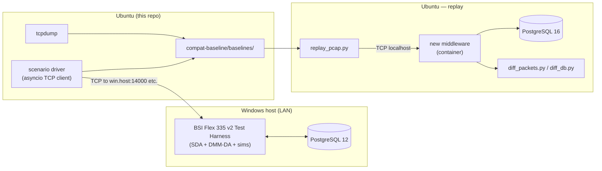

# Compatibility Baseline

This folder is the regression harness for the Linux Python middleware against
the Windows-only reference (`BSI-Flex-335-v2-Test-Harness/`).

## Approach

Everything tooled here runs from **Ubuntu**. The Windows machine is treated as
an opaque network peer: it runs the reference BSI Flex test harness on its
configured IP and ports, and Ubuntu reaches it over the LAN using TCP.

Two flows are supported, both Linux-side:

1. **Capture** — Ubuntu opens TCP connections to the Windows harness, drives a
   scenario (e.g. acts as an ASM, sends a Registration + StatusReports +
   DetectionReports), and records every byte going both directions. The result
   is committed under `baselines/<scenario>/<timestamp>/`.
2. **Replay** — the same captured client traffic is replayed against the new
   Python middleware running locally in a container. We diff outbound packets
   and (optionally) the resulting Postgres state against the Windows baseline.



## Layout

```
compat-baseline/
├── README.md          this file
├── scenarios/         one .md per scenario; describes inputs and pass criteria
├── capture/           Ubuntu-side; runnable test harness that talks to the Windows BSI Flex over IP
│   ├── README.md          full setup + usage
│   ├── setup.sh           one-time venv + proto generation
│   ├── generate_proto.sh  regenerate Python bindings from SAPIENT-Proto-Files
│   ├── requirements.txt
│   ├── env.example        SAPIENT_HOST, SAPIENT_DA_PORT, BASELINES_DIR
│   ├── drive_scenario.py  CLI: ./drive_scenario.py <scenario> --host ... --port ...
│   ├── driver/            framer (4-byte LE), recording asyncio client, message builders
│   ├── scenarios/         registration/status/detection/shutdown implemented; rest stubbed
│   ├── tests/             framer unit tests (no Windows host needed)
│   └── sapient_msg/       generated v2 protobuf bindings
├── replay/            Ubuntu-side; runs against the new middleware
│   ├── README.md
│   ├── replay_pcap.py
│   ├── diff_packets.py
│   └── diff_db.py
└── baselines/         captured artifacts, one subfolder per scenario+timestamp
    └── .gitkeep
```

## Windows host setup (one-time)

The Windows VM must be reachable from Ubuntu on the harness ports. Concretely:

1. Install the reference harness following its bundled user manual
   (`BSI-Flex-335-v2-Test-Harness/20240722-SAPIENT_BSI_Flex_335_v2_Test_Harness_User_Manual-O.pdf`).
2. Edit the harness `app.config` so `ClientAddress`, `TaskingAddress`,
   `GuiAddress` are `0.0.0.0` (or the LAN-facing NIC IP) instead of `127.0.0.1`.
   Without this, the harness only listens on loopback and Ubuntu cannot reach
   it.
3. Open Windows Firewall inbound rules for the harness ports
   (`14000`, `12002`, `12003` by default; `5432` only if you want Ubuntu to
   `pg_dump` the Windows PG remotely — see notes below).
4. Start the harness components in the configuration the scenario calls for.
5. Note the Windows host IP. Set `SAPIENT_HOST` in
   [`capture/env.example`](capture/env.example) to that value on Ubuntu.

Optional: to let Ubuntu `pg_dump` the harness DB directly, edit
`pg_hba.conf` and `postgresql.conf` on the Windows PG 12 install to allow
the Ubuntu IP. Otherwise treat the captured pcap as the sole source of truth
and reconstruct expected DB state from it during replay.

## Capture procedure (Ubuntu)

```bash
cd compat-baseline/capture
./setup.sh                                    # one-time: venv + proto codegen
cp env.example env && $EDITOR env             # set SAPIENT_HOST, SAPIENT_DA_PORT
. .venv/bin/activate
./drive_scenario.py registration              # uses ./env defaults
# or: ./drive_scenario.py registration --host 192.0.2.10 --port 14000
```

Output appears under `baselines/registration/<UTC-timestamp>/` containing
`sent.bin`, `recv.bin`, `transcript.jsonl`, and `manifest.json`. See
[`capture/README.md`](capture/README.md) for full details.

## Replay procedure (Ubuntu)

```bash
cd compat-baseline
docker compose -f ../docker-compose.yml up -d middleware db
./replay/replay_pcap.py baselines/registration/<timestamp>/capture.pcapng
./replay/diff_packets.py baselines/registration/<timestamp>/
./replay/diff_db.py      baselines/registration/<timestamp>/
```

Pass criteria are defined per-scenario under [`scenarios/`](scenarios/).

## Status

- `capture/` is **runnable**. Four scenarios are implemented end-to-end
  (registration, status, detection, shutdown); the other four
  (task, alert, error, reconnect) are stubs that raise `NotImplementedError`
  until we have a Windows host reachable and can iterate against the harness.
- `replay/` is still placeholder code; it will be wired up once we have at
  least one captured baseline and the new middleware container is running.

## Quick links

- [Architecture overview](../Architecture.md)
- [Scenario list](scenarios/)
- [Reference harness source](../BSI-Flex-335-v2-Test-Harness/)
- [SAPIENT v2 protos](../SAPIENT-Proto-Files/bsi_flex_335_v2_0/)
